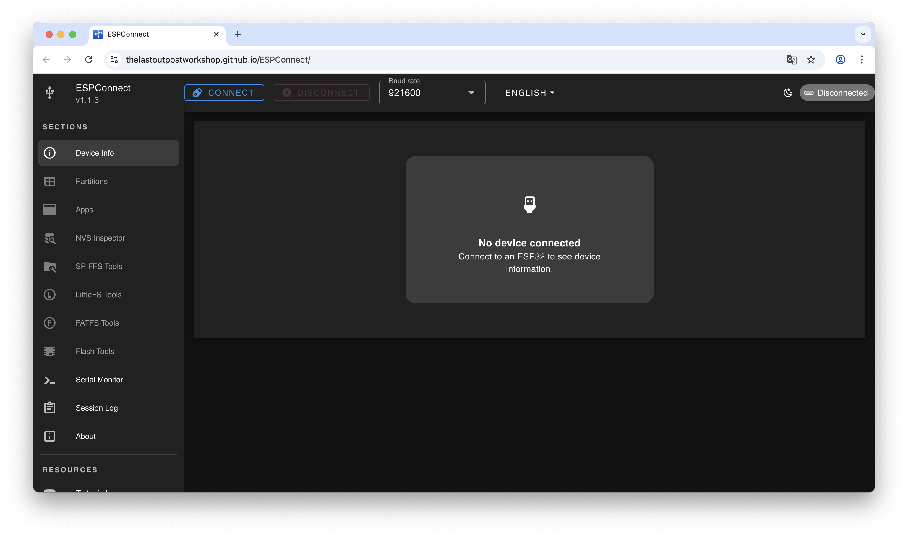
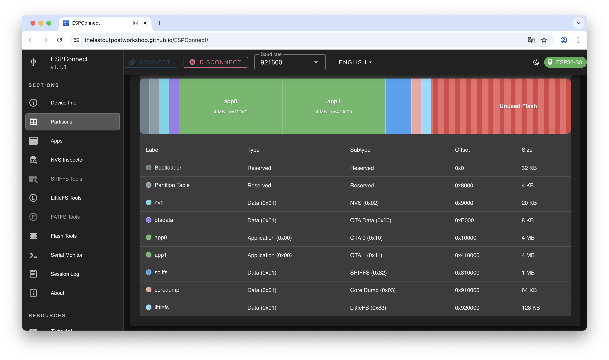
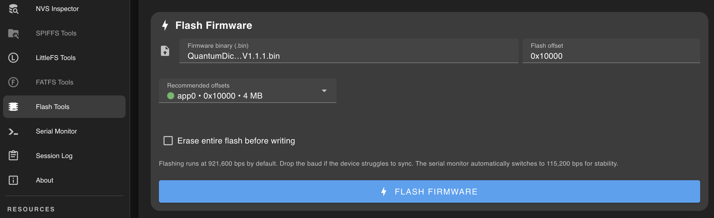
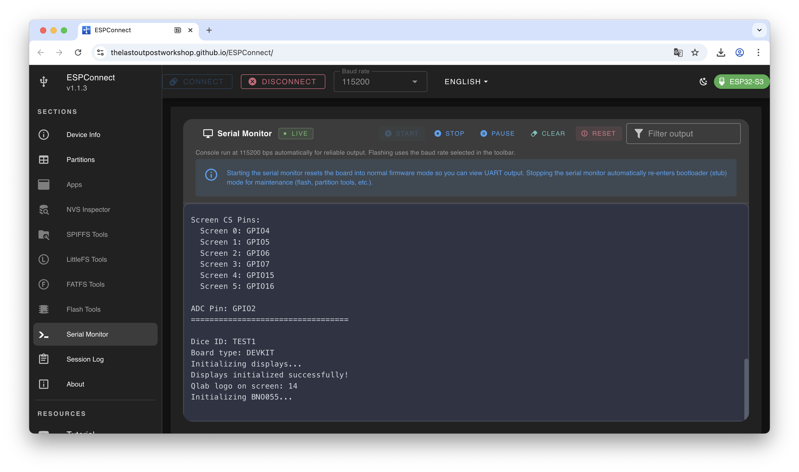

# 🎲 Quantum Dice Setup Guide

**Welcome!** This guide will walk you through setting up your Quantum Dice step-by-step. Don't worry if you're not technical – we've designed this guide to be easy to follow. Just take it one step at a time, and you'll have your Quantum Dice up and running in no time!

---

## 📑 Table of Contents

1. [What You'll Need](#what-youll-need)
2. [Understanding the Setup Process](#understanding-the-setup-process)
3. [Quick Reference: Common Tasks](#quick-reference-common-tasks)
4. [Getting Started](#getting-started)
   - [Downloading the Firmware Files](#step-1-download-the-firmware-files)
   - [Preparing Your Configuration File](#step-2-prepare-your-configuration-file)
5. [Setting Up Your First Dice (Dice A)](#setting-up-your-first-dice-dice-a)
   - [Connecting to ESPConnect](#step-3-connect-dice-a-to-your-computer)
   - [Getting the MAC Address](#step-4-get-the-mac-address-from-dice-a)
6. [Setting Up Your Second Dice (Dice B)](#setting-up-your-second-dice-dice-b)
   - [Getting Dice B's MAC Address](#step-5-get-the-mac-address-from-dice-b)
   - [Finalizing Your Configuration File](#step-6-finalize-your-configuration-file)
7. [Installing the Initialization Tool](#installing-the-initialization-tool)
   - [Flashing the Partition Tool](#step-7-flash-the-partition-tool-to-dice-b)
   - [Verifying the Partitions](#step-8-verify-the-partitions)
8. [Uploading Your Configuration](#uploading-your-configuration)
   - [Uploading the Config File](#step-9-upload-your-configuration-file-to-dice-b)
9. [Completing the Setup](#completing-the-setup)
   - [Setting Up Dice A](#step-10-repeat-steps-7-9-for-dice-a)
10. [Installing the Main Program](#installing-the-main-program)
    - [Flashing the Quantum Dice Firmware](#step-11-flash-the-quantum-dice-firmware-to-both-dice)
    - [Testing Your Setup](#step-12-verify-everything-works)
11. [Updating Your Dice Later](#updating-your-dice-later)
    - [Updating Firmware](#updating-the-firmware)
    - [Updating Configuration](#updating-your-configuration-file)
12. [Troubleshooting](#troubleshooting)
13. [Need More Help?](#need-more-help)

---

## What You'll Need

Before you begin, gather these items:

### Required Items

- ✅ **Your Quantum Dice pair** (marked as A and B) with displays removed
- ✅ **Computer** with internet access
- ✅ **USB-C cable** that supports data transfer (not just charging)
- ✅ **Web browser**: Chrome, Edge, or Opera (Safari and Firefox won't work)

### About Your Dice

- The USB-C connector is located on the **bottom side** of each dice
- You'll need to connect each dice **separately** during setup
- The dice are labeled **A** and **B** – keep track of which is which!

---

## Understanding the Setup Process

**Don't worry – this might look like a lot, but it's simpler than it seems!**

Here's what we'll do in plain English:

1. **Download files** – Get the software files from the internet
2. **Create a configuration** – Make a simple text file with your dice settings
3. **Get identification numbers** – Connect each dice to retrieve its unique address
4. **Set up storage** – Prepare the dice to store files (one-time only)
5. **Upload configuration** – Put your settings on each dice
6. **Install the main program** – Load the Quantum Dice software
7. **Test** – Make sure everything works!

**First-time setup takes about 20-30 minutes.** Future updates only take 5 minutes!

---

## Quick Reference: Common Tasks

**Use this section if you've already set up your dice and just need to do a quick update:**

### Updating the Firmware

1. [Download new firmware files](#step-1-download-the-firmware-files)
2. [Connect to ESPConnect](#step-3-connect-dice-a-to-your-computer)
3. [Flash the new firmware](#step-11-flash-the-quantum-dice-firmware-to-both-dice) *(remember to set Flash Offset to `0x10000`)*

### Updating Your Configuration File

1. [Connect to ESPConnect](#step-3-connect-dice-a-to-your-computer)
2. [Upload your updated config file](#step-9-upload-your-configuration-file-to-dice-b)

---

## Getting Started

### Step 1: Download the Firmware Files

**What you're doing:** Getting the software programs that run your Quantum Dice.

1. **Open your web browser** and go to:  
   [https://github.com/qlab-utwente/Quantum-Dice-by-UTwente/releases/](https://github.com/qlab-utwente/Quantum-Dice-by-UTwente/releases)

2. **Look for the latest release** at the top of the page (it will have a version number like v1.3.0)

3. **Download these two files:**
   - `Blink_to_partitions.bin` – This prepares your dice (one-time setup)
   - `QuantumDice.vX.X.X.bin` – This is the main program (X.X.X will be version numbers)

4. **Save them** to a location you'll remember (like your Downloads folder or Desktop)

✅ **You're done with Step 1!**

---

### Step 2: Prepare Your Configuration File

**What you're doing:** Creating a file that tells your dice how to behave and communicate with each other.

1. **Download the example configuration file:**  
   [TEST1_config.txt](TEST1_config.txt) *(right-click and "Save Link As...")*

2. **Open the file** with:
   - **Windows:** Notepad
   - **Mac:** TextEdit

3. **Read the instructions** inside the file – they explain what each setting does

4. **Change the Dice ID:**
   - Find the line that says `diceID=`
   - Change it to your dice set name (maximum 5 letters, e.g., `ALICE` or `BOB01`)
   - This helps you identify your dice set if you have multiple sets

5. **Save the file** with your new name:
   - Save it as `YOURNAME_config.txt` (replace YOURNAME with your dice ID)
   - **Example:** If your dice ID is ALICE, save it as `ALICE_config.txt`

6. **Keep this file open** – we'll add more information to it in the next steps

> 💡 **Tip:** The dice need to know each other's "addresses" (called MAC addresses). We'll get those in the next steps!

✅ **You're done with Step 2!**

---

## Setting Up Your First Dice (Dice A)

### Step 3: Connect Dice A to Your Computer

**What you're doing:** Connecting your first dice so we can talk to it.

1. **Open the ESPConnect tool** in your web browser:  
   [https://thelastoutpostworkshop.github.io/ESPConnect/](https://thelastoutpostworkshop.github.io/ESPConnect/)

   > 💡 **Don't be intimidated!** The tool looks technical, but you'll only use a few simple buttons.

2. **Connect Dice A** to your computer using your USB-C cable

3. **Click the "Connect" button** at the top of the ESPConnect page

4. **A popup window will appear** showing available ports:
   - Look for something like "USB Serial", "CP210x", or "COM" followed by a number
   - **If you see multiple options**, try disconnecting and reconnecting your dice – the new one that appears is yours!

5. **Select your dice's port** and click "Connect"

6. **Wait a moment** – the Device Info screen will appear showing details about your dice

✅ **You're connected!** You should see information about your ESP32 device.

---

### Step 4: Get the MAC Address from Dice A

**What you're doing:** Getting the unique identification number for Dice A.

1. **Look at the Device Info screen** – you should see a section labeled "MAC Address"

2. **Copy the MAC address:**
   - It looks like this: `D0:CF:13:36:17:DC`
   - Click the copy icon next to it, or select and copy it manually

3. **Switch to your configuration file** (the one you kept open from Step 2)

4. **Paste the MAC address:**
   - Find the line for Dice A: `deviceAMac=`
   - Paste the MAC address after the `=` sign
   - **Example:** `deviceAMac=D0:CF:13:36:17:DC`

5. **Save your configuration file** (but keep it open)

✅ **You've recorded Dice A's address!**

---

## Setting Up Your Second Dice (Dice B)

### Step 5: Get the MAC Address from Dice B

**What you're doing:** Now we'll do the same thing for your second dice.

1. **Disconnect Dice A** from your computer

2. **Connect Dice B** to your computer using the USB-C cable

3. **In ESPConnect, click "Connect"** again

4. **Select the port** (same process as Step 3)

5. **Copy Dice B's MAC address** from the Device Info screen

6. **Go back to your configuration file**

7. **Paste the MAC address:**
   - Find the line for Dice B: `deviceB1Mac=` or `deviceB2Mac=`
   - Paste the MAC address after the `=` sign

> ⚠️ **Important:** Both dice must have their MAC addresses in the **same** configuration file. Don't create separate files!

---

### Step 6: Finalize Your Configuration File

**What you're doing:** Completing your configuration and saving it.

1. **Review your configuration file** – make sure both MAC addresses are filled in

2. **Adjust any other settings** if needed (read the instructions in the file)

3. **Save the file** one final time

4. **You can now close the file** – we'll upload it to the dice next

✅ **Your configuration is complete!** Now let's put it on your dice.

---

## Installing the Initialization Tool

> 📌 **Note:** This section (Steps 7-8) is only needed for **brand new dice**. If you're just updating firmware or configuration, you can skip to [Step 9](#step-9-upload-your-configuration-file-to-dice-b).

### Step 7: Flash the Partition Tool to Dice B

**What you're doing:** Preparing Dice B's internal storage so it can save files.

**Make sure Dice B is still connected** from the previous step. If not, reconnect it.

1. **In ESPConnect, click "Flash Tools"** in the left sidebar

2. **Scroll down** to find the "Flash Firmware" section

3. **Click "Firmware binary (.bin)"** button

4. **Select the file** `Blink_to_partitions.bin` (from Step 1)

5. **Check the box** next to "Erase entire flash before writing"

6. **IMPORTANT: Check the Flash Offset field**
   - It **must** say `0x0`
   - If it says anything else, change it to `0x0`
   - This is critical for the tool to work correctly!

7. **Click the "⚡ Flash firmware" button**

8. **Wait patiently** – you'll see a progress bar.

9. **Success!** You should see a message saying "Flash complete"

✅ **The partition tool is installed on Dice B!**

---

### Step 8: Verify the Partitions

**What you're doing:** Checking that the storage was set up correctly.

1. **In ESPConnect, click "Partitions"** in the left sidebar

2. **Look at the partition list** – you should see several partitions including one called **`littleFS`**

   > 💡 **What you're looking for:** A partition named `littleFS` – this is where your configuration file will be stored.

3. **If you see `littleFS`** – perfect! Move to the next step.

4. **If you DON'T see it** – something went wrong:
   - Try Step 7 again
   - Make sure Flash Offset was set to `0x0`
   - See [Troubleshooting](#troubleshooting) if you continue having issues

✅ **Storage is ready!**

---

## Uploading Your Configuration

### Step 9: Upload Your Configuration File to Dice B

**What you're doing:** Putting your configuration settings onto Dice B.

**Make sure Dice B is still connected.**

1. **In ESPConnect, click "LittleFS Tools"** in the left sidebar

2. **Click "Download Backup"** button
   - This is a safety step required before uploading
   - Even if there's nothing to back up, click it anyway
   - Wait for it to complete

3. **After the backup completes**, the "Upload File" section will become available

4. **Click "Choose File"**

5. **Select your configuration file** (e.g., `ALICE_config.txt`)

6. **Click "Upload"** – the file uploads to your browser only (not to the dice yet!)

7. **Click "SAVE TO FLASH"** button

8. **Confirm** when asked (click "OK" or "Yes")

9. **Wait** for the upload to complete

10. **Verify the upload:**
    - Look for the 👁️ (eye icon) next to your file
    - Click it to view the contents
    - Make sure it matches your configuration file

✅ **Configuration uploaded to Dice B!**

---

## Completing the Setup

### Step 10: Repeat Steps 7-9 for Dice A

**What you're doing:** Setting up Dice A the same way you set up Dice B.

1. **Disconnect Dice B**

2. **Connect Dice A**

3. **Follow Step 7** – Flash the partition tool to Dice A

4. **Follow Step 8** – Verify the partitions

5. **Follow Step 9** – Upload your configuration file to Dice A  
   *(Use the SAME configuration file – both dice need the same config!)*

✅ **Both dice now have their storage set up and configured!**

---

## Installing the Main Program

### Step 11: Flash the Quantum Dice Firmware to Both Dice

**What you're doing:** Installing the main Quantum Dice program on both dice.

**Let's start with Dice A (already connected):**

1. **In ESPConnect, click "Flash Tools"** in the left sidebar

2. **Scroll to the "Flash Firmware" section**

3. **Click "Firmware binary (.bin)"** button

4. **Select the file** `QuantumDice.vX.X.X.bin` (from Step 1)

5. **⚠️ IMPORTANT: UNCHECK the box** "Erase entire flash before writing"
   - This is different from before!
   - If you erase, you'll delete your configuration!

6. **⚠️ CRITICAL: Change Flash Offset to `0x10000`**
   - Click in the Flash Offset field
   - Delete what's there
   - Type: `0x10000`
   - This MUST be correct or the dice won't work!

7. **Click "⚡ Flash firmware"**

8. **Wait** for the upload to complete (about 30 seconds to 1 minute)

9. **Success!** You should see "Flash complete"

10. **Repeat for Dice B:**
    - Disconnect Dice A
    - Connect Dice B
    - Follow the same steps (steps 1-9 above)

✅ **Quantum Dice firmware is now installed on both dice!**

---

### Step 12: Verify Everything Works

**What you're doing:** Making sure your dice are working correctly.

#### Method 1: Visual Test (If Displays Are Connected)

1. **Watch for the startup sequence:**
   - You should see logos and animations
   - The dice should display properly

✅ **If you see the startup sequence, your dice are working!**

#### Method 2: Serial Monitor Test

**This method works even without displays attached.**

1. **Connect one dice to your computer** (either A or B)

2. **In ESPConnect, click "Serial Monitor"** in the left sidebar

3. **Click "Start"** button

4. **Watch the text output** – you should see something like:

   ```
   Quantum Dice v1.3.0
   LittleFS mounted successfully
   Found config file: ALICE_config.txt
   Config loaded successfully
   MAC Address is : D0:CF:13:36:17:DC
   ✓ BNO055 initialization complete!
   Setup complete!
   ```

5. **What to look for:**
   - ✅ "Config loaded successfully"
   - ✅ "LittleFS mounted successfully"
   - ✅ Your dice ID and MAC addresses appear correctly
   - ⚠️ You might see some I2C error messages – these are usually okay if sensors initialize afterward

✅ **If you see "Setup complete!" you're all done!**

---

## Updating Your Dice Later

### Updating the Firmware

**When a new version comes out, here's how to update:**

1. **Download the new firmware file** (go to [Step 1](#step-1-download-the-firmware-files))

2. **Connect your dice to your computer**

3. **Open ESPConnect** ([Step 3](#step-3-connect-dice-a-to-your-computer))

4. **Flash the new firmware** ([Step 11](#step-11-flash-the-quantum-dice-firmware-to-both-dice))
   - Remember: Flash Offset = `0x10000`
   - Don't erase flash!

5. **Repeat for the second dice**

That's it! Your configuration stays intact.

---

### Updating Your Configuration File

**If you need to change settings:**

1. **Edit your configuration file** on your computer

2. **Connect your dice to your computer**

3. **Open ESPConnect** ([Step 3](#step-3-connect-dice-a-to-your-computer))

4. **Upload the new config file** ([Step 9](#step-9-upload-your-configuration-file-to-dice-b))

5. **Repeat for the second dice** (if needed)

---

## Troubleshooting

### "WebSerial API is not supported"

**What this means:** Your browser doesn't support the tool we need.

**Solutions:**

- ✅ Switch to Chrome, Edge, or Opera browser
- ✅ Update your browser to the latest version
- ❌ Safari and Firefox don't work – you must use Chrome, Edge, or Opera

---

### "Cannot connect to serial port" or "Port is not available"

**What this means:** Something is blocking access to your dice.

**Solutions:**

- ✅ Close Arduino IDE, PuTTY, or any other program that might be using the port
- ✅ Disconnect and reconnect your USB cable
- ✅ Try a different USB port on your computer
- ✅ Try a different USB-C cable (some cables are charge-only)
- ✅ Restart your computer if the problem persists

**To check if your computer sees the device:**

- **Windows:** Open Device Manager → look under "Ports (COM & LPT)"
- **Mac:** Open Terminal → type `ls /dev/tty.*` and press Enter
- **Linux:** Open Terminal → type `ls /dev/tty*` and press Enter

---

### "Flash failed" or "Upload failed"

**Solutions:**

- ✅ Check your USB cable – make sure it supports data transfer
- ✅ Try holding the BOOT button on your dice while clicking "Flash firmware"
- ✅ Make sure Flash Offset is set correctly:
  - `0x0` for partition tool
  - `0x10000` for Quantum Dice firmware
- ✅ Try a different USB port
- ✅ Make sure no other program is using the serial port

---

### Configuration File Not Loading

**Signs:** Serial monitor shows "No config file found" or uses defaults.

**Solutions:**

- ✅ Make sure your filename matches the pattern: `XXXXX_config.txt` (5 letters before _config.txt)
- ✅ Check that Flash Offset was `0x10000` when you flashed the main firmware
- ✅ Try uploading the config file again ([Step 9](#step-9-upload-your-configuration-file-to-dice-b))
- ✅ Use the eye icon (👁️) in LittleFS Tools to verify the file is actually on the dice

---

### Dice Show Errors on Serial Monitor

**I2C Errors:**

```
E (3535) i2c.master: I2C transaction unexpected nack detected
```

These are usually **normal** if you see "BNO055 initialization complete!" afterward. The sensors are just taking a moment to respond.

**Real Problems to Watch For:**

- ❌ "LittleFS mount failed" – means storage wasn't set up properly, redo [Step 7](#step-7-flash-the-partition-tool-to-dice-b)
- ❌ "Config load failed" – means your config file has errors or wasn't uploaded
- ❌ Setup never completes – check all previous steps

---

## Need More Help?

If you're stuck:

1. **Double-check you followed each step** – it's easy to miss something small!

2. **Look at the serial monitor output** – it often tells you exactly what's wrong

3. **Try the process on the other dice** – sometimes one dice has an issue but the other works fine

4. **Reach out for support:**
   - Check the GitHub repository for updates: [https://github.com/qlab-utwente/Quantum-Dice-by-UTwente](https://github.com/qlab-utwente/Quantum-Dice-by-UTwente)
   - Create an issue on GitHub with:
     - What step you're on
     - What error message you see
     - What you've already tried

---

## 🎉 Congratulations

You've successfully set up your Quantum Dice! The hard part is done. From now on, updates are quick and easy.

**Enjoy your Quantum Dice!** 🎲

---

*Document Version 1.1 – Last Updated: December 2024*
